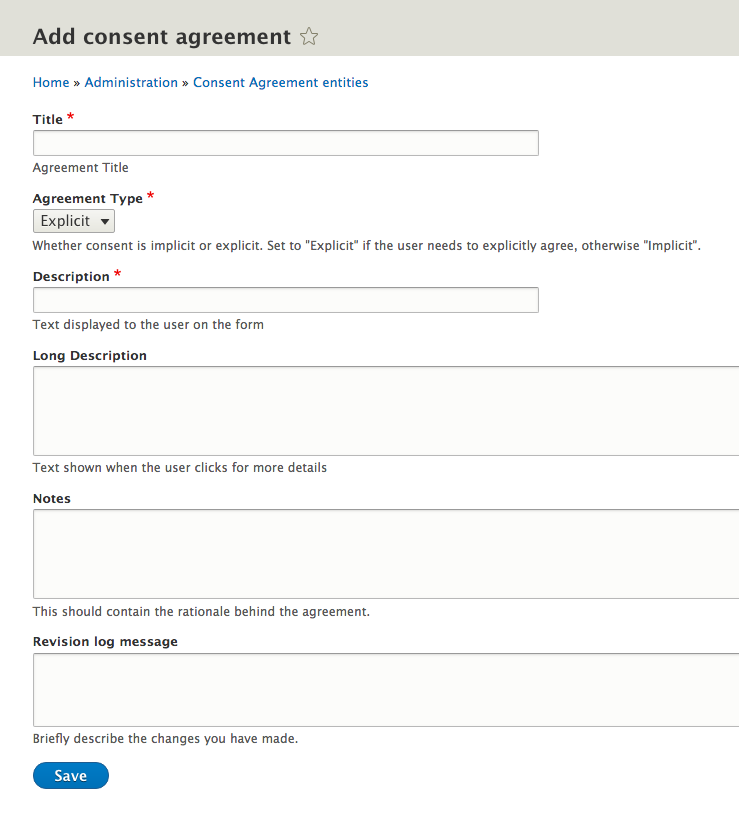

# Agreements

## Add consent agreements

To add a consent agreement, first navigate to the agreements page within the admin area. Click the button to add a consent agreement.

Next, you can enter in fields to set-up a new consent agreement:

* Title
* Agreement type
  * Explicit: Set this so that the user needs to specifically agree, they will see a checkbox that they have to tick for them to have consented.
  * Implicit: Set this if the user does not need to explicitly agree. In this case simply saving the form that contains implicit consent will count as consent.
* Description: Text to be displayed to the user on the form
* Long description: Text to be shown when the user clicks for more details
* Notes: The rationale behind the agreement
* Revision log message: Describe the changes you have made

## Accept an agreement as a user


TO BE COMPLETED – Where does this happen?


## Accept an agreement as a staff member


TO BE COMPLETED – Where does this happen?


