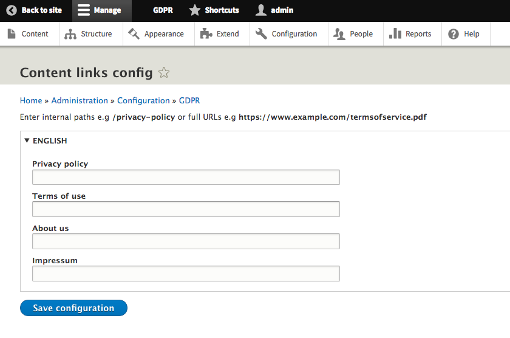

# Content Links

The content links tool allows you to enter internal paths e.g _/privacy-policy_ or full URLs e.g _https://www.example.com/termsofservice.pdf_ for your:

* Privacy policy
* Terms of use
* About us
* Impressum

