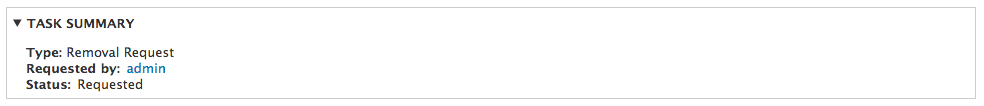
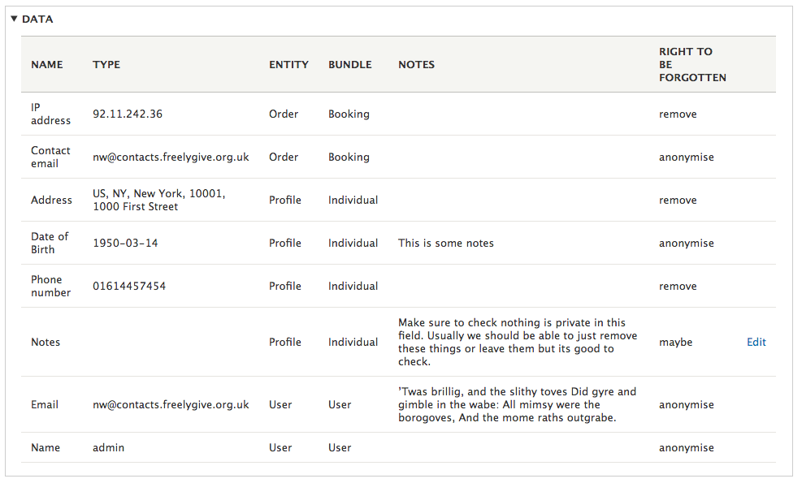
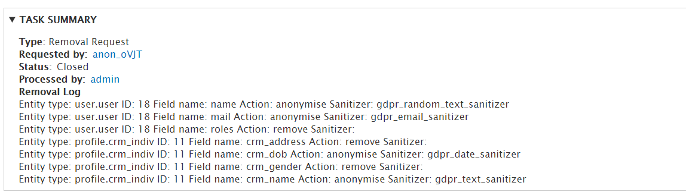

# Data Removal

## Perform removal as user

A user can perform a removal from their user dashboard by clicking on ‘All your data’ and then ‘My data requests’. Clicking the button ‘Request data removal’ will allow the user to request a removal, the user will see a message saying ‘Your request has been logged’ to inform them off a successful request and must wait for a staff member to process the request.

## Perform removal on behalf of user

A staff member can perform a removal for a user. Firstly the staff member should locate the user that they would like to perform a removal for and then click GDPR. On this page, the staff member can click on ‘Request data removal’ to perform a removal on behalf of the user.

## Processing a removal

First, navigate to the Task list page within the admin. Then click on the removal task that you would like to process from the requested tasks table.

You will see a task summary, where you can see the type of request, who requested the removal and the status.

In the data table you can see all the data that will be processed. Some of the fields are editable, click the edit button if you wish to make any changes to editable fields. This will apply to any notes fields particularly or anything else with “maybe”. There will be some fields where there are organisational reasons why you don’t want to remove all the content but manually you may need to delete any data that legally falls under the right to erasure.

Click remove and anonymise data to process the removal. During this process the user will also be blocked and their login credentials anonymised. There is no way for them to restore their account after this. Once the removal is complete a log is displayed which shows the results of the processing.

