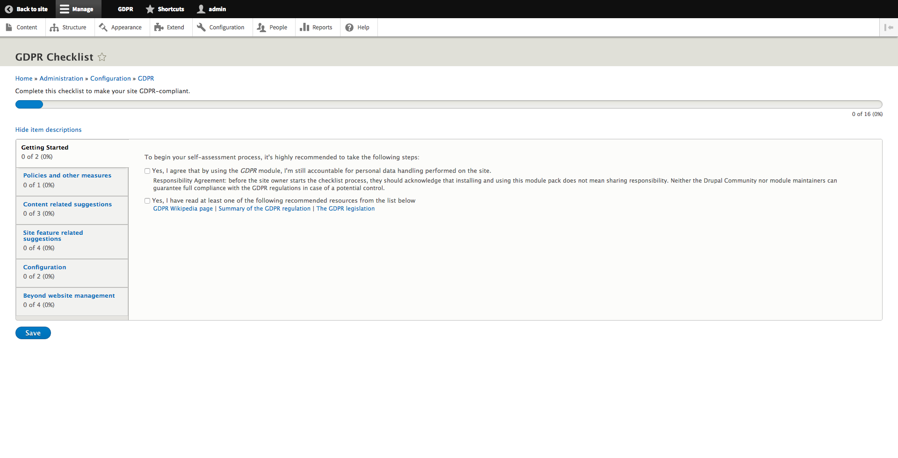

# GDPR Checklist

This tool can be found within the admin configuration. The GDPR checklist tool can be used to make sure that your site is GDPR compliant. 

The tool consists of the following sections for site admins to complete.

## Getting Started

The getting started tab has the following questions within it:

> Yes, I agree that by using the _GDPR_ module, I'm still accountable for personal data handling performed on the site.

> Yes, I have read at least one of the following recommended resources from the list below

## Policies and other measures

The policies and other measures tab has the following checkbox within it:

> Cookie policy

## Content related suggestions

The content related section automatically searches for nodes containing a: "Privacy Policy", "Terms of Use", "About us" or "Impressum". If they're not configured already, you will be prompted to configure them on the [Content link configuration page](content-links.md).

The content related suggestions page also has the following checkboxes:

> I have checked through the site's content and verified that a page containing Privacy Policy exists and has been published to this site.

> I confirm the existing "Privacy Policy" or similar page has been published.

> I confirm the published "Privacy Policy" or similar page is included in at least one menu of the site.

## Site feature related suggestions

This group of checkpoints addresses various actions to be taken regarding site features:

> Yes, I'm aware there are external traffic measurement and user tracking services integrated on this site

> Yes, I'm aware there are connections established between this site and some social media platforms

> I confirm that all Drupal core, community, and custom modules have been revised as to not gather any unnecessary personal data of site visitors

> I have examined all aspects of displayed personal data, associated with this site, to ensure that all users can access only permitted types of information according to their role

## Configuration

Checkboxes here allow you to make changes in your site configuration:

> Allow users to cancel their own user account

> Users need to be able to request for removal of all their personal data.

## Beyond website management

Further checkboxes within this tab ensure that the site admin has taken all steps necessary to ensure compliance:

> I have found and consulted with a legal adviser

> I have enabled all features of the GDPR module

> I declare that I am able to notify the supervisory authority within 72 hours in the case of a personal data breach

> I confirm that I have understood that the responsibility of personal data logging is dependent on the size of my organisation as described below:
>
> * Has fewer than 250 employees the processing it carries out is likely no result in a risk to the rights and freedoms of data subjects, the processing is only occasional and the processing does not includes special categories of data \(Article 30/5\) and as such my organisation is not required to create records of processing activities
> * My organisation has 250 or more employees and records of processing activities have been prepared according to Article 30 of the regulation​

