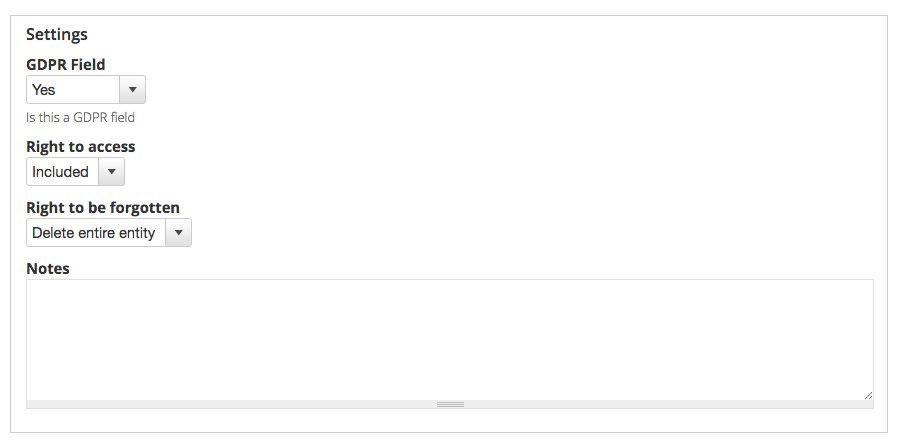

# Field List

The GDPR field list or field config page lists all of the fields on Drupal that can be configured for GDPR compliance. This is built for Data Protection Officers and provides an overview of all the relevant GDPR information on a field level, including notes to help provide evidence of compliance to regulators if needed. This will help with an organisation’s documentation on GDPR compliance but will not entirely replace it.

## Configure a field for GDPR

To configure or edit a field, first locate the field that you would like to configure, you can make use of the filters and sorting options to narrow down on the field that you are looking for.

There are three main types of fields that will be configured: [general fields](gdpr-field-list.md#general-fields), [entity reference fields](gdpr-field-list.md#entity-reference-fields) and [primary keys](gdpr-field-list.md#primary_keys).

### General fields

* GDPR Field - Specify whether or not this is a GDPR field
* Field is owner - If this is checked, the entity will be included for any task including the entity this property references
* Do not follow this relationship - If this is checked, this relationship will not be followed when looking for additional personal information
* Right to access
  * Choose from: Not included, Maybe, Included
* SARs filename - Specify which file this should be included in.
* Right to be forgotten
  * Choose from: Not included, Maybe, Remove, Anonymise
  * Choosing anonymise will present you with another dropdown ‘Sanitizer’ to use with the following options:
    * Text sanitizer
    * Archive party sanitizer
    * Name sanitizer
    * Email sanitizer - Currently uses \[random\]@example.com so not to accidentally go to a real email address
    * Date sanitizer - Always sets to 01/01/1000
    * Long text sanitizer
    * Username sanitizer - Adds the word “anon” to the beginning of the username so that you’ll know which ones have been anonymised in reports.
    * User status sanitizer
    * Password sanitizer
* Notes
  * A text field to add notes such as: This is for your own personal audit trail, you can put a brief explanation for why you have chosen to use these settings for the benefit of the DPO and any future auditors

### Entity reference fields

* GDPR Field - Specify whether or not this is a GDPR field
* Field is owner - If this is checked, the entity will be included for any task including the entity this property references
* Do not follow this relationship - If this is checked, this relationship will not be followed when looking for additional personal information
* Right to access
  * Choose from: Not included, Maybe, Included
* SARs filename - Specify which file this should be included in.
* Right to be forgotten
  * Choose from: Not included, Maybe, Remove, Anonymise
  * Choosing anonymise will present you with another dropdown ‘Sanitizer’ to use with the following options:
    * Text sanitizer
    * Archive party sanitizer
    * Name sanitizer
    * Email sanitizer - Currently uses \[random\]@example.com so not to accidentally go to a real email address
    * Date sanitizer - Always sets to 01/01/1000
    * Long text sanitizer
    * Username sanitizer - Adds the word “anon” to the beginning of the username so that you’ll know which ones have been anonymised in reports.
    * User status sanitizer
    * Password sanitizer
* Notes
  * A text field to add notes such as: This is for your own personal audit trail, you can put a brief explanation for why you have chosen to use these settings for the benefit of the DPO and any future auditors

### Primary Keys

For every entity, the primary key is the entity id field. If this is removed as part of a right to be forgotten request, the whole entity will be deleted, not just the field.

* GDPR Field - Specify whether or not this is a GDPR field
* Right to access
  * Choose from: Not included, Maybe, Included
* Right to be forgotten
  * Choose from: Not included, Maybe, Delete entire entity
* Notes
  * A text field to add notes such as: This is for your own personal audit trail, you can put a brief explanation for why you have chosen to use these settings for the benefit of the DPO and any future auditors

### Certain computed properties and required fields

Some fields can not be deleted because that would cause issues but they can still be anonymised if necessary.  
  

