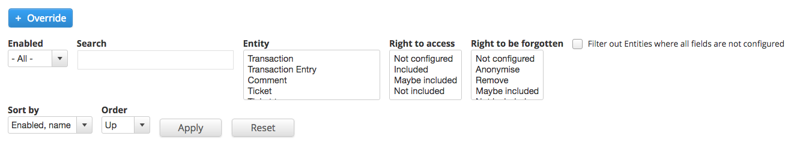

# Field List

The GDPR field list page lists all of the fields on Drupal that can be configured for GDPR compliance. This is built for Data Protection Officers and provides an overview of all the relevant GDPR information on a field level, including notes to help provide evidence of compliance to regulators if needed. This will help with an organisation’s documentation on GDPR compliance but will not entirely replace it.

## Configure a field for GDPR

To configure or edit a field, first locate the field that you would like to configure, you can make use of the filters and sorting options to narrow down on the field that you are looking for.

There are three main types of fields that will be configured:

### General fields

* GDPR Field - Specify whether or not this is a GDPR field
* Field is owner
* Do not follow this relationship
* Right to access
* SARs filename
* Right to be forgotten
* \(If Right to be forgotten is anonymise\) Sanitizer to use
* Notes

### Entity reference fields

Field is owner

Do not follow this relationship

SARs filename

### primary\_keys

For every entity, the primary key is the entity id field. If this is removed as part of a RTF request, the whole entity will be deleted, not just the field.

RTF = Delete entire entity. 

Then click ‘edit’ on the right-hand-side of the table. 

Next, click the checkbox next to ‘This is a GDPR field’ if it is not already checked at which point you will be presented with 3 fields that you can edit: 

* Right to access
  * Choose from: Not included, Maybe, Included
* Right to be forgotten
  * Choose from: Not included, Maybe, Remove, Anonymise
  * Choosing anonymise will present you with another dropdown ‘Sanitizer’ to use with the following options:
    * Date sanitizer - Always sets to 01/01/1000
    * Email sanitizer - Currently uses \[random\]@example.com so not to accidentally go to a real email address
    * Long text sanitizer
    * Password sanitizer
    * Random text sanitizer
    * Text sanitizer
    * Username sanitizer - Adds the word “anon” to the beginning of the username so that you’ll know which ones have been anonymised in reports.
  * Each sanitiser is used for different fields depending on the kind of field you are dealing with.
* Notes
  * A text field to add notes such as: This is for your own personal audit trail, you can put a brief explanation for why you have chosen to use these settings for the benefit of the DPO and any future auditors

  
  
\*\*Certain computed properties and required fields\*\*  
Some fields can not be deleted because that would cause issues. Can still be anonymised if necessary.  
\* \`This field cannot be removed, only anonymised.\`   
  

