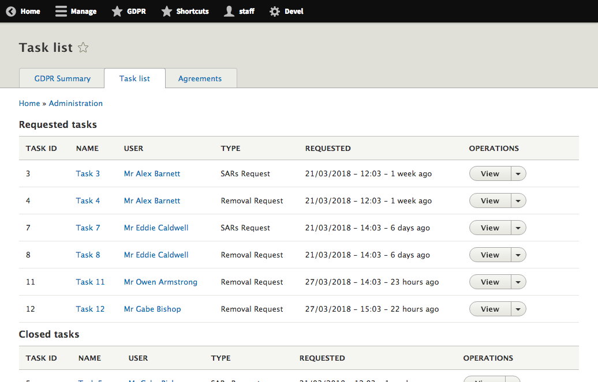
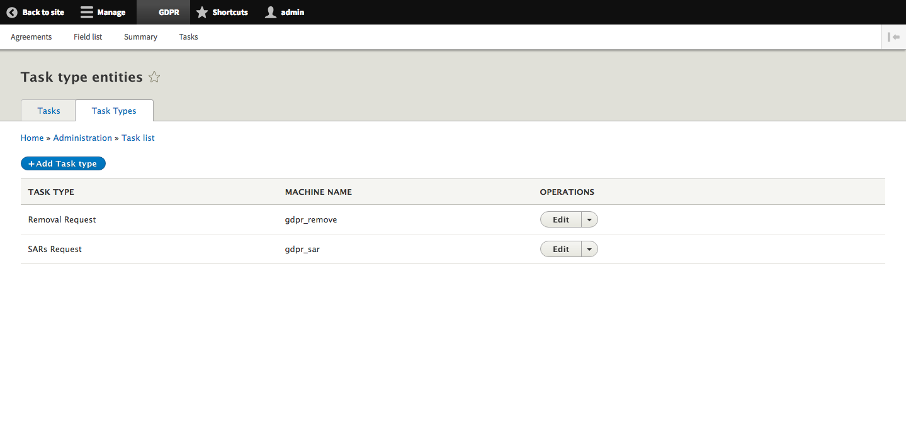

# Tasks

## Task List

The task list page lists all of the tasks where either a user or staff member has made a request. Requested tasks can be in the form of a ‘SARs Request’ or a ‘Removal Request’. In the list you can see the requested tasks and a list of the closed tasks. Just looking at the requested tasks, each task has the following properties:

* Task ID: A unique identifier
* Name: The name of the tasks
* User: The user who requested the task
* Type: The type of task, either a SARs Request or Removal Request
* Requested: The date at which the tasks was requested
* Requested by: The user who requested the task and a link to their profile
* Operations: The operations that can be performed on the task, such as: View or Delete.

## Task Type

The task type pages allows you to create new task type entities to be used across the site. The default task type entities are:

* Removal request
* SARs request

