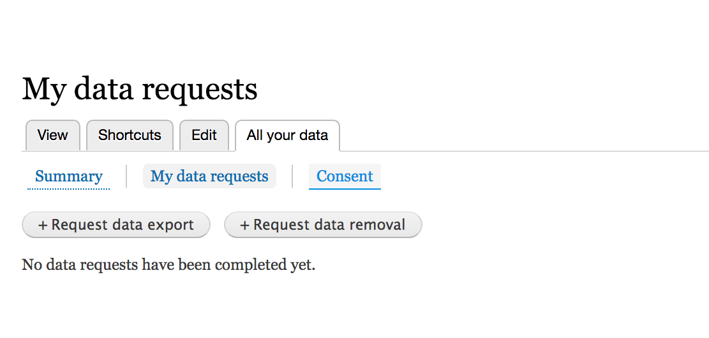
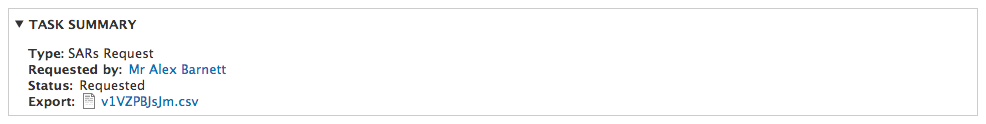
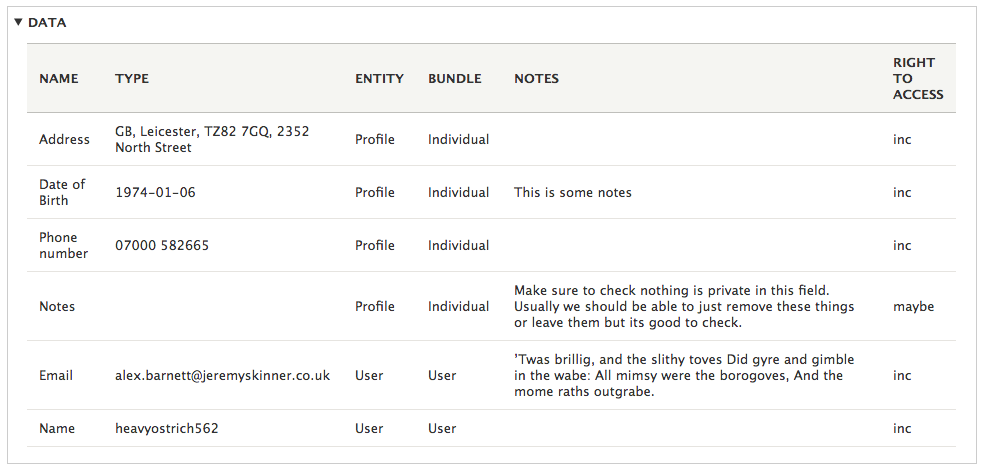

# Subject Access Request

## Perform SAR as user

A user can perform a SAR from their user dashboard by clicking on ‘All your data’ and then ‘My data requests’. Clicking the button ‘Request data export’ will allow the user to request a SAR, the user will see a message saying ‘You request has been logged’ to inform them off a successful request and must wait for a admin to process the request.

## Perform SAR on behalf of user

A site admin can perform a SAR for a user. Firstly the admin should locate the user that they would like to perform a SAR for and then click GDPR. On this page, the admin can click on ‘Request data export’ to perform a SARs on behalf of the user.

## Processing a SAR

First, navigate to the [Task list page](gdpr-tasks-list.md#task-list) within the admin. Then click on the SAR that you would like to process from the requested tasks table.

You will see a task summary, where you can see the type of request, who requested the SAR, the status and a initial version of the CSV that you can export.

In the data table you can see all the data that will be processed. Some of the fields are editable, click the edit button if you wish to make any changes to editable fields.

Finally, there is a data override text box where you can perform overrides. This allows you to manually take any of the data in the “Maybes” column and put it into the export and also and any extra data that an admin feels is necessary.

Click process to process the SAR and allow the user to download a CSV from their user dashboard.

### 

