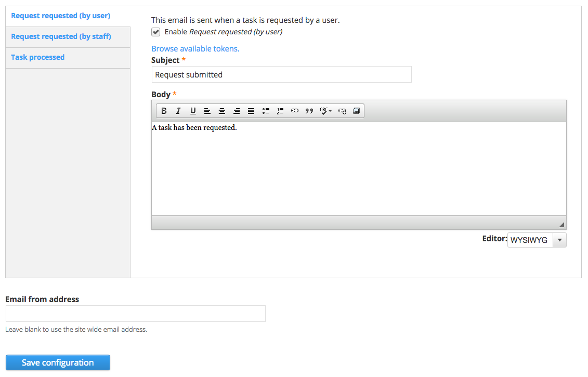

# Task Emails

Emails triggered on task events can be configured on the task emails page. There are three task emails that can be edited: Request requested \(by user\), Request requested \(by staff\) and Task processed.

All three email types have the same fields:

* Enable \[email type\] - This checkbox will enable or disable the email type
* Subject - This text field can be edited to change the subject line of the email
* Body - This text area field can be edited to change the body of the email 
* Email from address - This text field can be edited to change the email from address, or it can be left blank to use the site wide email address.

