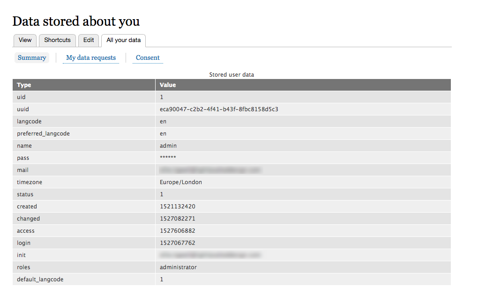
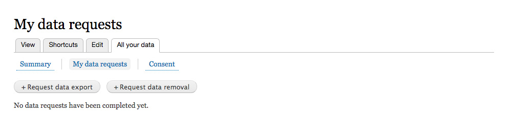
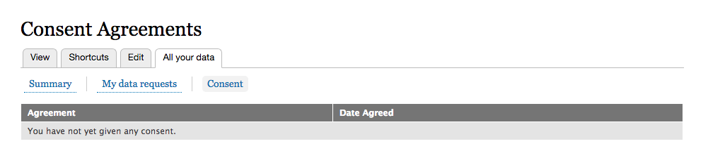

# Viewing Stored Data

All data stored on an individual is conveniently stored within a user’s dashboard.

First, navigate to the user dashboard and click on ‘All your data’. There are three tabs available here:

## Summary

Here the user can see all of the data that is held on them.

## My data requests

This tab allows a user to perform tasks such as a [data removal](data-removal.md) or [data export \(SAR\)](subject-access-request.md), members of staff can also navigate to a user’s dashboard and operate these buttons on their behalf if they have written in or requested these things over the phone.

## Consent

This tab shows all of the consent that the user has given including the date and time agreed. The user can click on the agreement type to view more information such as:

* Title
* Agreement Type
* Description
* Long Description
* Author

